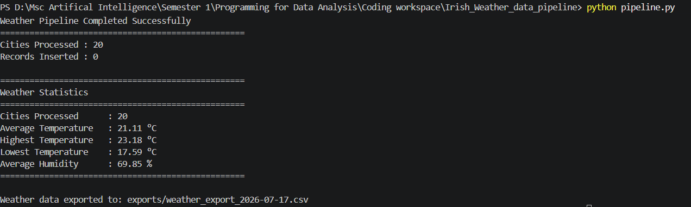
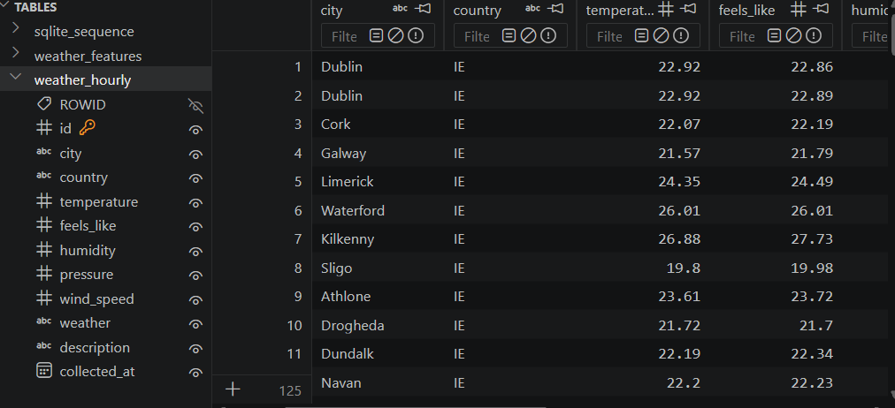
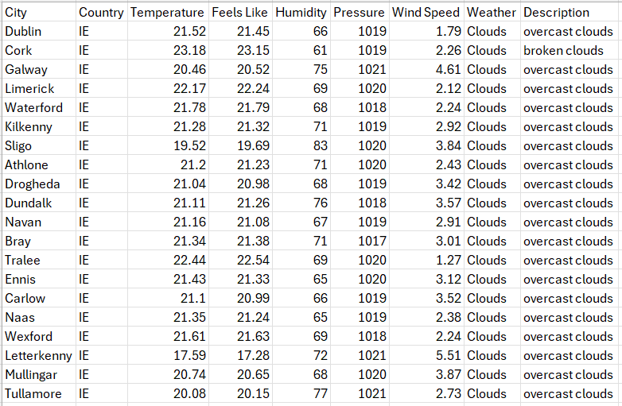

# Irish Weather Data Pipeline

## Project Overview

The Irish Weather Data Pipeline is an ETL (Extract, Transform, Load) project developed in Python.

The pipeline collects real-time weather data for multiple Irish cities using the OpenWeatherMap API, performs feature engineering, stores both raw and processed data in a SQLite database, generates summary statistics, and exports the collected data to CSV format.

---

## Features

- Collects live weather data from the OpenWeatherMap API
- Supports multiple Irish cities
- Stores raw weather observations in SQLite
- Prevents duplicate records
- Generates engineered weather features
- Stores engineered features separately
- Calculates weather summary statistics
- Exports processed weather data to CSV
- Includes unit tests for feature engineering
- Uses logging for monitoring pipeline execution

---

## Technologies Used

- Python 3
- OpenWeatherMap API
- SQLite
- Requests
- CSV
- Logging
- Git & GitHub

---

## Project Structure

```
Irish_Weather_Data_Pipeline/

│
├── analytics.py
├── api.py
├── config.py
├── database.py
├── export.py
├── feature_engineering.py
├── pipeline.py
├── utils.py
│
├── data/
│      weather.db
│
├── exports/
│      weather_export_YYYY-MM-DD.csv
│
├── tests/
│      test_feature_engineering.py
│
├── README.md
└── requirements.txt
```

---

## ETL Workflow

### Extract

- Fetch current weather data from the OpenWeatherMap API.
- Collect weather information for multiple Irish cities.

### Transform

- Categorize:
  - Temperature
  - Humidity
  - Pressure
  - Wind Speed
- Generate summary statistics.

### Load

- Store raw weather data in SQLite.
- Store engineered weather features.
- Export processed weather data to CSV.


## Output

The project produces:

- SQLite database (`weather.db`)
- Engineered weather features
- CSV export in the `exports` folder
- Weather summary statistics
- Pipeline log messages

---

## Future Improvements

- Scheduled automatic data collection
- Data visualization dashboard
- Support for additional weather APIs
- Machine learning weather prediction

---

## AI Transparency

Artificial Intelligence was used as a learning support tool throughout this project. It was primarily used to

- Understand Python concepts and clarify programming doubts.
- Explore ideas for improving the ETL pipeline and feature engineering.
- Receive guidance on debugging and resolving coding errors.
- Improve project documentation and README structure.
- Review code quality and obtain suggestions for improvements.

All generated suggestions were reviewed, understood, tested, and adapted before being incorporated into the final implementation. The final design decisions, implementation, testing, and validation of the project were completed by me.

### AI Conversation Reference

The development support conversation used during this project is available at:

https://chatgpt.com/share/6a58e636-643c-83eb-a1ed-477ae2a04fb6

---

## Project Output

### Pipeline Execution

The pipeline successfully fetches weather data from the OpenWeatherMap API, stores it in SQLite, generates engineered features and exports the results to CSV.



---

### SQLite Database

The collected weather observations are stored in a SQLite database.



---

### CSV Export

Processed weather data is exported as a CSV file for further analysis.

